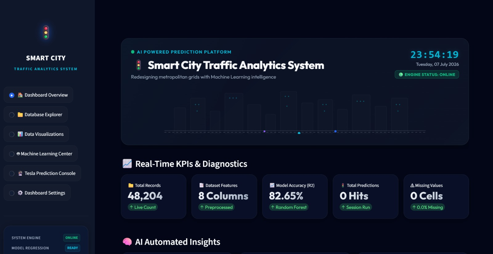

# 🚦 Smart City Traffic Analytics System

<p align="center">
  
</p>
<p align="center">
  <b>AI-Powered Traffic Analytics & Prediction Platform using Machine Learning</b>
</p>

---

## 📌 Project Overview

The **Smart City Traffic Analytics System** is an AI-powered web application developed using **Python**, **Streamlit**, and **Machine Learning**. It analyzes traffic datasets, visualizes traffic patterns, and predicts traffic volume using the **Random Forest Regression** algorithm.

The project provides an interactive dashboard where users can explore traffic data, generate visualizations, preprocess datasets, train ML models, and make real-time traffic predictions.

---

## ✨ Features

- 📊 Interactive Dashboard
- 📂 Traffic Dataset Explorer
- 📈 Data Visualization
- 🧹 Data Preprocessing
- 🤖 Machine Learning Model Training
- 🚗 Traffic Volume Prediction
- 📉 Correlation Heatmap
- 🌡 Temperature vs Traffic Analysis
- ☁ Cloud Coverage Analysis
- 📊 Model Accuracy (R² Score)
- ⚡ Fast Streamlit UI

---

## 🛠 Tech Stack

- Python
- Streamlit
- Pandas
- NumPy
- Matplotlib
- Seaborn
- Plotly
- Scikit-learn

---

## 📂 Project Structure

```
Smart-City-Traffic-Analytics-System/
│
├── DataSet/
│   └── traffic.csv
│
├── images/
│   └── dashboard.png
│
├── app.py
├── requirements.txt
└── README.md
```

---

## 🚀 Installation

### Clone Repository

```bash
git clone https://github.com/harshmishra4118-alt/Smart-City-Traffic-Analytics-System.git
```

### Open Project

```bash
cd Smart-City-Traffic-Analytics-System
```

### Install Dependencies

```bash
pip install -r requirements.txt
```

### Run Application

```bash
streamlit run app.py
```

---

## 📊 Machine Learning Model

**Algorithm Used**

- Random Forest Regressor

**Workflow**

- Data Loading
- Data Cleaning
- Label Encoding
- Feature Engineering
- Train/Test Split
- Model Training
- Traffic Prediction
- Model Evaluation (R² Score)

---

## 📷 Dashboard Preview

<p align="center">

</p>

---

## 📈 Dataset

The project uses a Smart City Traffic dataset containing:

- Temperature
- Rain
- Snow
- Cloud Coverage
- Weather
- Date & Time
- Traffic Volume

---

## 🎯 Future Improvements

- Live Traffic API Integration
- AI Traffic Recommendations
- Accident Prediction
- Real-Time Dashboard
- Traffic Congestion Alerts
- User Authentication
- Cloud Deployment

---

## 👨‍💻 Developer

**Harsh Mishra**

B.Tech CSE Student

AI & Machine Learning Enthusiast

---

## ⭐ Support

If you like this project, don't forget to ⭐ star this repository.

---

## 📜 License

This project is developed for educational purposes.